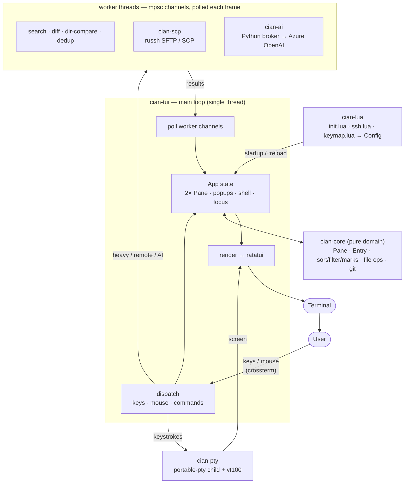

# cian

[English](README.md) · **日本語**

[](https://github.com/taketan9/cian/actions/workflows/ci.yml)
[](https://github.com/taketan9/cian/releases)

**C**omfortable **I**nterface for **A**gile File e**X**plorer **N**avigation — シェルを内蔵した2ペイン型のターミナルファイラーです。[AFXW（あふｗ）](https://akt.d.dooo.jp/akt_afxw.htm)に着想を得ています。

バイナリ1つ。macOS と Windows。ランタイムもDLLも要らず、一緒に入れるものもありません。

**目次** — [ダウンロード](#ダウンロード) · [基本](#基本) · [すばやく移動する](#すばやく移動する) · [テキストエディタパネル](#テキストエディタパネル) · [探す](#探す) · [比較と整理](#比較と整理) · [ファイルとバージョン管理](#ファイルとバージョン管理) · [SSH とリモートペイン](#ssh-とリモートペイン) · [シェルパネル](#シェルパネル) · [マクロ](#マクロ) · [AI](#ai-任意) · [日本語入力](#日本語入力-ime) · [設定](#設定) · [ソースからビルド](#ソースからビルド) · [構成](#構成) · [Windows 導入](#windows-へオフライン導入) · [困ったとき](#困ったとき) · [ライセンス](#ライセンス)

---

## ダウンロード

**[→ リリース](https://github.com/taketan9/cian/releases)** — 3つのパッケージと、照合用の `SHA256SUMS` が付いています。

| プラットフォーム | パッケージ | 中身 |
|---|---|---|
| macOS（Intel / Apple シリコン） | `cian-macos.zip` | ダブルクリックで起動する `cian.app` と、ターミナル用の `cian-tui` |
| Windows x64 | `cian-windows-x64.zip` | `cian.exe` / `cian-tui.exe` / `install.ps1` — [オフライン導入](#windows-へオフライン導入)を参照 |
| エンジンだけ | `cian-server-win-x64.exe` | 約1MB — Electron 版が喋る相手。Rust の無い機械向け |
| ビルドする人向け | `cian-source-offline.zip` | 依存クレートを全部同梱したソース一式 — [ソースからビルド](#ソースからビルド)を参照 |

展開して実行するだけです。インストーラの質問に答える必要はなく、設定を保存するまで置いたディレクトリの外には何も書きません。

**ファイラは1つ、ビルドは2つ。** `cian` はウィンドウを開き、動かすのに何も
入れる必要がありません。`cian-tui` は今ある端末の中で動きます — ssh 先や
tmux の中はこちらでないと届きません。以下の説明は、断りがなければ
`cian-tui` のものです。ウィンドウ版は同じプログラムから端末を抜いただけです。

**ダウンロードした `cian.app` が「開いていません」と言われたら。** macOS は、
ブラウザ経由で届いたアプリに隔離属性を付け、Apple の公証を受けていないものを
止めます（Sequoia からは右クリック→開くの抜け道もありません）。cian は
Apple Developer 証明書での署名・公証をしていないので、これに当たります。
どれか一つで通ります:

```sh
xattr -dr com.apple.quarantine /path/to/cian.app   # 属性を外す。確実
gh run download <run-id> -n cian-macos             # そもそも付けない。ブラウザを経由しない
```

システム設定 →「プライバシーとセキュリティ」を下までスクロールし、
**「このまま開く」** でも通ります。自分でビルドしたものには最初から付きません。

- Windows では **Windows Terminal** か **WezTerm** ＋ Nerd Font を。アイコンと角丸が正しく出るのはそこです。オフライン導入は[下のほう](#windows-へオフライン導入)。
- **`?`** で全キー一覧。現在のキーマップから生成するので、自分で割り当てたキーも載ります。シェルからは `cian-tui -man`、コマンドラインの使い方は `cian-tui -h`。
- 画面は既定で日本語です。英語にするなら `cian.set_option("lang", "en")`、または右クリックメニューから。

---

## 基本

2つのペインが左右に並びます。その間でコピー・移動する — それが全部です。

| キー | 動作 |
|---|---|
| **← / →** | ペイン間でフォーカス移動 |
| **Enter** | ディレクトリ・アーカイブに入る／**ファイルはその場で読む** — そのペインにビューアが開き、機能はすべて使えます。`F12` で全画面、`Tab` で隣の一覧へ、`:q` で閉じる |
| **Ctrl+Enter** | ファイルを既定のアプリで開く（ディレクトリなら反対ペインで開く） |
| **Alt+← / Alt+→** | このペインの履歴を戻る／進む（タイトルの **◀ ▶** クリックでも） |
| **Backspace** | 1階層上へ（`..` 行のクリックでも） |
| **`j` `k`**・矢印 | カーソル移動 |
| **`Space`** | カーソル位置のファイルをマーク |
| **`Ctrl+A`** | 全マーク（`:markall`） |
| **`c` / `m`** | マークしたファイルを反対ペインへコピー／移動 |
| **`d`** | 削除（ゴミ箱へ） |
| **`r`** | リネーム |
| **`a` / `A`** | 新規ファイル／新規ディレクトリ |
| **`u`** | 直前のリネーム・作成・移動を取り消し |
| **`F3`** | カーソル位置のファイルを**反対のペインで**読む |

- **うっかりで失うものはありません。** コピー・移動・削除は必ず確認、削除はゴミ箱行き、`u`（`:undo`）で直前の数手を巻き戻せます。
- **重い処理はバックグラウンド**で進捗バー付き。**Esc** で中止、`b` でポップアップを畳んでも `⏳ copying 45% +2` のチップが追跡します。
- **操作はキューに並びます。** コピー中の2件目は拒否されず順番待ちに。`:queue` で実行中と待ち行列、`x` で停止・取り消し。転送失敗は2回まで自動再試行。30秒バイトが動かない転送は `⚠ 停滞` になり、もう一度 `x` で応答しないワーカーを見捨てて残りを流します。
- **長い処理は終了時にベルと通知**を出します。トグル（`T`）か `cian.set_option("notify", false)` でオフ。

**マウス。** クリックでカーソル移動、ダブルクリックで開く、反対ペインへドラッグでコピー（Shift+ドラッグで移動）。ダイアログには本物のボタン、ホイールでポップアップをスクロール、ポップアップの外をクリックで閉じる、境界線のドラッグで分割比率を変更。ウィンドウ版では**右クリックは OS のメニュー**です — Windows はエクスプローラのものそのまま（ファイル上なら コピー・切り取り・名前の変更・削除・プロパティ＋各アプリが追加した項目、ファイルのない余白なら**そのディレクトリのメニュー＝貼り付け・新規作成**）、macOS は AppKit のメニュー（開く／このアプリケーションで開く／Finder で表示／クイックルック／パスをコピー／ゴミ箱へ）。cian 自身のメニューは **Shift+Enter**・**`M`**・`:menu`・Shift+右クリック。端末版には出せる OS メニューがないので、右クリックは従来どおり cian のメニューです。

**デスクトップとの出し入れ。** Finder / エクスプローラからウィンドウへドラッグしたファイルは、確認のうえフォーカス中のペインへ**移動**します。逆向きはドラッグにできません（ターミナル上のプログラムはドラッグ*元*になれない）ので、**`Shift+P`** が橋渡しです — 選択をOSのファイル参照としてクリップボードに載せ、Finder / エクスプローラで `Cmd/Ctrl+V` すれば貼り付きます。

---

## すばやく移動する

ファジーピッカー。数文字打って Enter。

| キー | 何を選ぶか |
|---|---|
| **`C`**（`:palette`） | すべてのコマンド |
| **`Z`**（`:jump`） | 最近／ブックマークのディレクトリ |
| **`:files`** | ツリー全体のライブ・ファイル検索 |
| **`:recent`** | このセッションで開いたファイル |
| **`T`**（`:toggle`） | ライブ設定 — 隠しファイル・入力同期・通知・転送ベリファイ・言語 |
| **`:du`** | 容量分析（大きい順、`Enter` で中へ） |

**`:each <cmd>`** はマークした各ファイルにコマンドを実行します — `:each gzip {}`（`{}` がパス）、または末尾にパスが付く `:each md5sum`。

---

## テキストエディタパネル

`Enter` と `F3` は**同じもの**（以下すべて）を、違う場所に開きます。`Enter` は**そのペインにドッキング**します — 反対のペインは隣に残り、そのペインにフォーカスがある間キーはファイルのもの、ヘルプは画面下部のバーに出ます。`F3` は**反対のペインで**開きます — 一覧はそのまま、隣でファイルを読む形です（ディレクトリに対する `o` / `Shift+O` と同じ言い回し）。すでに向こうで何か読んでいるときは、**別タブ**として開きます（読んでいるものを置き換えません）。**F12** でパネルが全画面になり、もう一度で戻ります（一覧やシェルと同じズームです）。`Tab` で隣の一覧との行き来（両ペインでファイルを開いていればファイル同士の行き来）、`Shift+Tab` はこのパネル内のタブ移動、閲覧中は `Shift+H` / `Shift+L` / `Shift+J` で左ペイン・右ペイン・シェルへフォーカス移動、他のパネルをクリックしてもそちらへ移ります。`:q` で閉じます。

ドッキング中、枠に残るのは**ファイル名と ✕** だけで、あとは**画面の一番下に集約**されます — キー一覧はヒントバー、モード（`READ` / `EDIT` / `COMMAND` / `VISUAL`）とカーソルの行・桁はステータスバー、`:` と `/` の入力は cian のプロンプト行（ファイルペインが使うのと同じ行）に出ます。

### 開けるもの

| 種類 | 表示 |
|---|---|
| テキスト | 行番号つきスクロール表示＋シンタックスハイライト（Rust, Python, JS/TS, Java, HTML, CSS, SQL, shell, Lua, YAML, JSON …） |
| Markdown | レンダリング表示。`:preview` でプレビュー↔ソース |
| 画像（`.png .jpg .gif .bmp .webp`） | ウィンドウ版と kitty / iTerm2 / WezTerm / sixel では実ピクセル、他ではカラーのハーフブロック |
| Office・PDF（`.docx .xlsx .pptx .pdf`、旧 `.doc .xls .ppt`） | テキストを抽出。変換ソフト不要 |
| アーカイブ（`.zip .jar .tar .tar.gz …`） | メンバー一覧 — `Enter` で1件、`a` で全部を展開 |
| その他 | 16進ダンプ |

Shift_JIS は自動判別して復号します（UTF-16 は BOM で判別）。判別が外れたら `e` で強制指定。

### 読む

vim 風です：`h j k l`・`w b`・`0 $`・`gg G`・`Ctrl-D/U`・`Ctrl-F/B`・`{` `}`、`%` で対応する括弧。`/` で検索、`n`/`N` で次・前、`*` と `#` はカーソル位置の語を検索。`v` `V` `Ctrl-v` で選択、`y` でコピー、`Ctrl+A` で全選択。`zz` `zt` `zb` でカーソル行を画面の中央・上・下へ。

**オペレータは移動と組み合わせます。** `d` `c` `y` は上のすべての移動と組めます — `dw` `d$` `d}` `d2w` `dfx` `c%` `y}` — 重ねると行単位（`dd` `cc` `yy`）。**テキストオブジェクト**がもう半分です：`diw` / `daw` で語、`ci"` / `da"` で引用符の中、`di(` `da(` `di{` `da{` `di[` `di<` で括弧の中（入れ子・複数行対応）。`f x` は次の `x` へ、`t x` はその手前へ（`F` `T` は後方）、`;` `,` で繰り返し。

**数字は動作の前に置くと回数**になります — `3j`・`5w`・`2}`、`48G` で48行目。**打ちかけの内容はプロンプト行に出る**ので、`48G` を手探りで打つことはありません。`Esc` で取消。

| キー | 動作 |
|---|---|
| `F2` / `Shift+F2` | 次／前の開いているファイル（複数マークして `F3` で全部開く） |
| `Shift+F8` / `Shift+F9` | 左右／上下に分割。`Shift+F10` で解除 |
| `Shift+H` / `Shift+L` | もう片方へ移動（クリックでも） |
| `=` | 左右の差分に印 — 両方を編集しながら追随します |
| `]c` / `[c` | その差分を順に移動 |
| `]]` / `[[` | 次／前の見出し・定義 |
| `Space` / `za` / `zA` | 1セクション折りたたみ／全体を切替 |
| `:summary` | AI にファイルの要約（右クリックからも）。選択範囲の**コード点検・修正**は右クリックメニューから |
| `?` | ビューア専用のキー一覧（用途別） |
| **Tab** | 隣のペインへ移動／戻る — 一覧でも、開いている別のファイルでも。シェルには行きません（そちらは `Shift+J`） |
| **Esc 3回** | `:q!` と同じく閉じる。1回で閉じては未保存の変更が危ないが、3回続けて押すのは事故ではないので |
| **Shift+Tab** | **このパネル内**で次の開いているファイルへ（`F2` / `Shift+F2` は前後） |
| `:new` | 空のファイルをこのペインに開く。`:w <名前>` で保存して以後その名前で編集 |
| `m a` / `' a` | マークを置く／戻る（`` ` a`` は桁も再現） |
| `Ctrl+O` / `Ctrl+I` | ジャンプ元を戻る・進む |
| `.` | 直前の変更をもう一度（入力した内容ごと） |
| `]c` / `[c` / `Tab` | 比較中：次・前の差分へ |
| `:q`  `:q!`  `:wq` | このファイルを閉じる（最後の1つでビューアが閉じる）。**Esc では閉じません**。右上の **✕** クリックでも |

開いている各ファイルは、それぞれのカーソル位置・折りたたみ・未保存の編集を保持します。分割を解除しても、もう片方は破棄せずタブに戻ります。

**アウトライン列**は Rust, Python, JavaScript, Java, C, shell, SQL, Lua, Go, Ruby, Markdown, YAML, INI, CSS, Makefile の見出しと定義を並べ、カーソルが*中にいる*ものを強調します。パーサではなく正規表現なので、入れるものは何もなく、SSH 越しのストアドプロシージャでも効きます。`:outline` で消せます。

**ルーラーと十字**が本文の上に出ます（5桁ごとに印・10桁ごとに数字、カーソルの桁を強調し、その行に色を敷く）。`:ruler` で消せます。

### 編集する

| キー / コマンド | 動作 |
|---|---|
| `i` `a` `A` `o` `O` `I` | 挿入 — 前・後・行末・新しい行。`Ctrl+S` はファイル自身のエンコーディングで保存、`Esc` で抜ける、`Shift+Q` で破棄 |
| `s` `S` `C` | 1文字・1行・行末までを打ち直す |
| `r`*x* / `R` | 1文字を上書き（`3rx` で3文字）。`R` は `Esc` まで上書き |

| `x` `dd` `D` `J` | vim の小さな変更セット。`d` は `v`/`V` の選択を切り取り |
| `p` / `P` | カーソルの後／位置に貼り付け（vi 流の位置） |
| `u` / `Ctrl+R` | 取り消し／やり直し — 直前のリネーム・作成・移動**・ディレクトリ移動**を、起きた順の1本のスタックで |
| `gg` / `G` / `5gg` | 先頭・末尾・5行目 |
| パネルより長い行 | 折り返さず、カーソルを追って横スクロールします（レコードの形が崩れません）。右と下の枠線のバーが画面外の量を示し、はみ出しているときだけ出ます |
| `w` `b` `e` / `W` `B` `E` / `ge` | 単語単位（記号で区切る）と WORD 単位（空白まで一続き）。`ge` は手前の語の末尾へ |
| `gJ` / `:combine` / `:combine!` / `:combine 3` | 次の行を連結 — 空白なし／空白あり／3行分。（`Shift+J` はシェルです） |
| `Ctrl+R` | やり直し |
| `Ctrl+S` `Ctrl+C` `Ctrl+X` `Ctrl+V` `Ctrl+Z` `Ctrl+Y` `Ctrl+A` | 保存・コピー・切り取り・貼り付け・取り消し・やり直し・全選択。**READ／EDIT／ビジュアルの3モードすべて**で同じ。`Ctrl+C` / `Ctrl+X` は選択、なければカーソル行。Ctrl を端末に取られる場合のために `:w` `:undo` `:redo` も同じ動作 |
| `~` | カーソル位置の大文字小文字を反転 |
| `>>` / `<<` | 行をタブ幅ずらす（選択中は `>` / `<`） |
| `:edit` | `$VISUAL` / `$EDITOR`（なければ nvim → vim → vi）で開き、戻ったら再読込 |
| `Ctrl+Q` / `Alt+v`（`:block`） | 矩形選択 — `d` `I` `A` `c`。`$` のあと `A` で、長さの違う各行の末尾に同じ文字列を追記。どれが届くかは端末次第 |
| `V` のあと `I` / `A` | 選択した全行の先頭／末尾に挿入 |
| 検索後の `:r` | パターン入りの置換プロンプト（`r` は vi の1文字上書き） |
| **`Ctrl+H`**（`:replace` でも） | **置換バー** — 画面下部の入力行に「置換前」「置換後」の2欄が出ます（ファイルは見えたまま）。`Tab` で欄を移動、`Enter` で1件置換してそこで停止、`Shift+Enter` ですべて置換、`Alt+n` は置換せず次の一致へ。`Alt+r` で **文字通り → ワイルドカード(`*` `?`) → 正規表現** を順に切替、`Alt+c` 大小区別、`Alt+w` 単語単位。`\n` `\t` `\r` はどちらの欄でも使えます。ワイルドカードなら `rep*rt` で `report` に一致します。正規表現の `*` は**直前の文字の繰り返し**なので、そちらでは `rep.*rt` です（該当なしのときはその旨を出します） |
| `:s/old/new/[gci]` | 同じことを vi 流に — `g` 行内すべて、`c` 1件ずつ確認、`i` 大小無視 |
| `:expand` / `:unexpand` | タブ ↔ 空白 |
| `:lf` / `:crlf` | 改行コード変換 |
| `:nobom` | UTF-8 BOM を除去（ペインからはマークしたファイルに） |
| `:g/re/d` | 一致した行を削除（`:v/re/d` は一致した行だけ残す） |
| `:sort` `:rsort` `:uniq` | 行の並べ替えと重複除去（選択範囲または全体） |
| `:han` / `:zen` | 文字幅 — `:han` は全角英数と半角カナの両方を直します。この表の各動詞と同じく、`v` / `V` の選択があればその範囲だけ、なければファイル全体に効きます |
| `:reindent` | 三者三様のインデントを一本の梯子に揃える |

矩形は文字数ではなく**表示桁**で数えます。日本語の上に引いた矩形は引いたとおりの矩形になり、短い行は挿入時だけ埋められ、削除では放置されます。いずれも undo 1回分です。

**保存はファイルをそのまま返します。** 書き戻されるのはファイル自身の文字 — 開いたときの BOM、開いたときの改行コード、そしてタブ。どれも画面では見えず、どれも実質的な変更なので、意図したとき以外は起きません（`:nobom` / `:lf` `:crlf` / `:expand`）。タイトルに `· UTF-8 BOM`・`· CRLF` と出ます。

**見えない文字**は描きます — タブ `→`、行末空白 `·`、全角空白 `□`、LF `↓`、CR `↵`。何も無いように見えて厄介ごとを起こすのはまさにこれらだからです。`:ws` でオフ。タブ幅は既定4桁、`cian.set_option("tab_width", 8)` がタブ区切りファイルを揃える設定です。

**バイナリは16進で編集**します。`i` のあと16進数キーでカーソル下のバイトを上書き。上書きのみ（オフセットがずれず、サイズも変わらない）で、`Ctrl+S` は元ファイルの `.bak` を残してから保存します。

### vim のキーか、メモ帳のキーか

ここまでは全部 vi の文法で、これが既定です。vi が手に馴染んでいない人のために、
同じエディタがもう1つの文法にも答えます — **`:notepad`**、一覧での `T`、または
パネル自身のメニュー（Shift+Enter）の**エディタのキー操作**。`:editstyle vim` で
戻ります。**エディタは1つで、その上の文法が2つ**です。バッファ・undo スタック・
検索・置換・保存はどちらも同じコードで、違うのは「ノーマルモードが存在するか」
の1点だけです。

メモ帳文法では、開いた瞬間から入力状態です。Shift+矢印で選択、Alt+Shift で矩形、
Ctrl+矢印で単語単位。Ctrl+X / C / V / A / S / Z / Y は他のアプリと同じ意味で、
この7つは vi 文法でも同じように効きます。ノーマルモードが無いので `Esc` で戻る
先も、開くコマンドラインもありません — **`:` はただの文字**として入力され、
`Esc` 3回で退出します（未保存があれば確認します）。

`cian.set_option("edit_style", "notepad")` で最初からその文法で始まります。

### まわりの機能

- **カーソル追従プレビュー（既定オン）。** シェル枠の領域がカーソル位置のものをプレビューします — コードは色つき、画像、ディレクトリとアーカイブの一覧、Office/PDF のテキスト。シェルは下で動き続けていて、`Shift+J` かクリックで戻ります。リモートペインではあえてプレビューしません（触れるたびダウンロードになるため）。画像は端末のプロトコル（kitty / iTerm2 / sixel）があればそれで、無ければ半角ブロックで描きます。プロトコルを名乗るのに何も描かない端末では `:image` で切り替えられ、`:version` が現在の方式を表示します。`:preview` でオフ。展開やスキャンをしないと何も出せない種類は**既定で対象外**です — `.vsix` `.jar` `.whl` `.iso` `.msi` `.pdf` `.mdf` など。`.zip` や `.tar` は対象外にしていません（中を見るために開くので）。`cian.set_option("preview_skip", { "bak" })` で追加できます。`F3` ではどれも開けます。
- **アーカイブの中に入れます。** zip や tar に `Enter` でペインが*中*に入り、ディレクトリのように歩けます。外へのコピーは立っている場所からの相対で展開。**zip なら逆向きも**：中へコピー、`F2` でメンバーをリネーム、`d` で削除 — アトミックに書き直し、残るメンバーは再圧縮なしのコピー。tar/tar.gz は読み取り専用、パスワード付き zip は変更しません。メンバーに `F3` で本物のビューアが開き、保存すると zip に書き戻します。
- **クラウド上のファイルはそのまま。** 同期した OneDrive / Teams / iCloud / Google ドライブには未ダウンロードのファイルが並び、読むとネットワーク越しに実体化されます。該当ペインには **☁** 列が出て、一括処理（grep・`:count`・`:hash`・`:duplicate`・`:preview`）は飛ばして件数を報告します。`F3`・コピー・開くといった意図的な操作は今までどおり。`cian.set_option("read_cloud_files", true)` で一括処理にも読ませられます。
- **読んでいるものについて聞く。** 右クリック（`Shift+Enter`）でファイルの上に短いメニュー — この文章を推敲、コマンドを説明・作成、このコードを点検（選択範囲、無ければ全体）。ファイルは閉じずに脇へ避け、チャットを閉じると戻ります。
- **SharePoint の文書。** どのローカルディレクトリが同期ライブラリかを教えると（`cian.sharepoint{ { local = …, url = … } }`）、`:office` が**クラウド側の実体**を Word / Excel に渡すので、チェックアウトと共同編集が効きます。`:officelink` は同じ住所の `.url` を書き出します（メールに貼るのはこちら）。
- **クリップボードが無くてもコピー＆貼り付け。** ヤンクは OS のクリップボードと cian の中の両方に持つので、クリップボードサービスの無いマシンでも3行のコピーができます。

---

## 探す

| キー | 動作 |
|---|---|
| **`/`** | 打つたびに一覧を絞り込み（Enter で確定、Esc で解除） |
| **`f`** | このディレクトリ内の一致を順に移動 |
| **`Shift+F`** | このディレクトリ以下から名前で検索 |
| **`Ctrl+F`**（`Ctrl+G`・`:grep` でも） | ファイルの中を grep — Enter でその行を開く。`Ctrl+G` はサクラエディタと同じ割り当て |
| **`b`** | ブランチビュー — 配下すべてを1つの一覧に平坦化 |
| **`,`** | 名前／サイズ／日時／拡張子で並べ替え（`n` `s` `d` `e`） |

検索はバックグラウンドで走り、見つかった順に流れます（**Esc** で中止）。結果一覧では **`p`** で該当をペインに展開でき、マークして通常どおり操作できます。

**`r` は grep 結果の全ファイルにまたがる置換です。** 変更予定の行をすべて（ファイル・行番号・置換後）見せ、`Space` で1行除外、`f` でそのファイルの残りを除外、`a` で全反転、`Enter` で書き込み。`Enter` までディスクには触れず、そのとき各ファイルを読み直します — プレビュー以降に変わった行は飛ばして数えます。古い行番号への一括書き込みは、この種の道具がデータを壊す典型だからです。

`:hidden` で隠しファイルの表示切替（既定は表示）。

**パターン** — 検索を打つ場所すべてで同じ書き方です。

| こう打つと | こういう意味 |
|---|---|
| `error` | ただの文字列、大小無視 |
| `/ORA-\d+/` | 正規表現 |
| `/ora-\d+/i` | 同上の大小無視 — フラグは `i` だけ |
| `/^ERROR/` | ERROR で始まる行（grep） |
| `/\.(log\|trc)$/` | `.log` か `.trc` で終わる名前（find） |

素で書けばリテラル（エスケープ不要）、スラッシュで囲めば正規表現（[Rust の `regex`](https://docs.rs/regex)。後方参照・先読みなし）。書き損じた正規表現は理由付きで拒否され、黙って別のものに一致することはありません。

**エンコーディング。** UTF-8 として読めないファイルは Shift_JIS で読み直すので、`エラー` はどちらの文字コードでも見つかります — Oracle の alert ログや AIX のバッチ出力が現役の現場のための仕様です。

---

## 比較と整理

**`=`**（`:diff`）— 2つのファイルを左右に並べて差分を強調（`n`/`N` で移動）、または2つのディレクトリをバイト単位で比較。どちらからでも：

| キー | 動作 |
|---|---|
| `>` / `<` | カーソルの項目を反対側へコピー（ファイルでもサブツリーでも） |
| `]` / `[` | ツリー全体を片方向に同期。削除はせず、必ず確認 |
| `w` | 比較結果を HTML / Markdown レポートに保存（拡張子で判定） |
| `x` | 何が変わったか AI に説明させる |

- **`:duplicate`** — このペイン配下のバイト単位で同一のファイルをチェックリストで提示。各グループ1つを残し、残りは通常の削除確認へ。
- **`:renamepattern`** — マークしたファイルをテンプレート（`report_{n3}.{ext}`）か置換（`s/IMG/photo/i`）でリネーム。`old → new` を確認してから適用。AI もネットワークも使いません。
- **`:renamelist`** — 名前を1行1件のテキストとしてエディタで開き、保存して終了すると変更行がそのままリネームになります（入れ替えも可）。全件成立か全件中止で、重複や行の消失があればバッチごと取り消し。`:cq` でキャンセル。

---

## ファイルとバージョン管理

| コマンド | 動作 |
|---|---|
| `:attr` | 権限と所有者 |
| `:chmod 644` | モード変更（Windows は `:readonly`） |
| `:readonly on\|off` | 読み取り専用属性の切替 |
| `:hash md5` / `:hash sha256` | チェックサム |
| `:count` | ファイル数・行数・ステップ数 |
| `:where` | どの設定ファイルをどこから読んでいるか |

**まとめる。** `:zip` / `:tar` / `:targz` でマークしたファイルを1つに、`:zip -e` で暗号化 zip。`:unzip`（右クリック **▸ ここに展開**）はカーソル位置のアーカイブを新しいサブディレクトリへ展開します。ロックされた zip も F3 でメンバー一覧は出て、展開時にパスワードを聞きます。

ステータス行には常にアクティブペインのドライブの空き容量が出ます（80% 超で橙、95% 超で赤）。

**git と svn はそのまま動きます。** 各行にバッジ（`●` ステージ済み、`✚` 変更、`?` 未追跡、`‼` 競合）、ステータス行にブランチ（または `svn r123`）、F3 は HEAD との差分行に印。`:stage` `:unstage` `:discard` `:log` `:gitdiff`、ビューアの `B` で blame — すべて右クリック **Git ▸** / **SVN ▸** にもあります。cian はあなたの `git` / `svn` を呼びます。

---

## SSH とリモートペイン

**`:remote`**（`:sftp`）で片方のペインがサーバになります。ローカルと見間違えないよう**カーマイン**の枠。移動は普通のペインと同じで、加えて：

| キー | 動作 |
|---|---|
| `c` / `m` | 境界を越えてコピー／移動 — ローカル↔サーバ、サーバ↔サーバ（このマシン経由の中継） |
| `A` `a` `r` `d` | サーバ側で 新規ディレクトリ・新規ファイル・リネーム・削除（削除は再帰。必ず確認） |
| `F3` | リモートのファイルを開く。保存するとそのままアップロード |
| `Esc` | 抜けてローカルに戻る |

右クリック **転送 ▸** は一発版です — **アップロード → サーバ**（ホスト・ユーザ・リモートディレクトリ・任意でモード）、**ダウンロード ← サーバ**（辿ってマークし、置き場所を選ぶ）。

外部 `scp` は使わない純 Rust 実装です。SFTP を使い、SFTP サブシステムが無いサーバでは従来の SCP にフォールバックし、どちらで運んだかをステータス行が言います。`cian.set_option("verify_transfers", true)` で転送後に読み直して両端のチェックサムを比較します。

**`Shift+S`**（`:ssh`）はホスト→ユーザの2段ピッカーを開き、コマンドをシェルに打ち込みます（自分の ssh 設定とエージェントがそのまま効きます）。ホストは `init.lua` に：

```lua
cian.ssh({
  users = { "root", "deploy", "app" },          -- 全ホスト共通の候補
  hosts = {
    { name = "web1", host = "10.0.1.11" },
    { name = "db1",  host = "10.0.2.31", users = { "postgres", "root" } },
    { name = "bast", host = "203.0.113.9", port = 2222 },
  },
})
```

パスワードは任意です。ssh が聞いてきたら cian が打ち、SFTP/SCP でも同じものを使います：

```lua
users = {
  { name = "postgres", password = "..." },                 -- このファイルに直接
  { name = "deploy",   password_cmd = "pass srv/deploy" },  -- 資格情報ストアから
  "root",                                                   -- 鍵認証。何も保存しない
}
```

平文の `password` はファイルの中の秘密なので、Unix では誰でも読めるファイルだと警告します。パスワードはログにも画面にも出ず、ホスト鍵の確認には決して答えません。

**帯域。** サーバへのコピーは他人のネットワークを使うコピーです。`:limit 2M` で毎秒2メガバイトに抑えられます（`500k`、`1.5MB/s`、`off`）。`cian.set_option("transfer_limit", "2M")` なら毎回。上限が効いている間は進捗バーに `≤2.0M/s` と出るので、わざと遅いのか壊れているのか迷いません。


---

## シェルパネル

下段は本物のシェル（`$SHELL`）です。**`Shift+J`**・クリック・`:shell` でフォーカス、**Esc** でファイルへ戻ります。**流れていった出力は残ります** — 10,000行、色もそのまま。パネル上でホイールを回すとさかのぼれ、`Shift+PageUp` / `Shift+PageDown` で1画面ずつ、`Shift+↑` / `Shift+↓` で1行ずつ、`Shift+Home` / `Shift+End` で両端へ。今どこを見ているかはバッジとバーが示し、何か入力すれば最新に戻ります。分割している場合は各ペインが独立してさかのぼれます。全画面プログラム（vim, less, htop）は Esc とファンクションキーを自分のものにします。ドラッグで範囲選択（離すとコピー）。右クリックで専用メニュー — SSH接続・貼り付け・セッションログ・SFTP/SCP・文字コード。

| キー | 動作 |
|---|---|
| `F1`–`F8` | シェルタブ 1–8 へ |
| `F9` / `F10` | 新しいタブ／タブを閉じる |
| `Shift+F1` / `Shift+F2` | 次／前の分割ペインへ |
| `Shift+F8` / `Shift+F9` | 左右／上下に分割 |
| `Shift+F10` | 分割を閉じる（確認あり） |
| `F12` / `Shift+F12` | 全体をズーム／分割ペインだけズーム |

**入力同期** は `:sync` か右クリックから。1回打てばタブ内の全ペインに届き、その間パネルは明るい **⇄ SYNC** 枠になります。

**スニペット**は何度も打つ行のことです：

```lua
cian.snippets{
  { name = "sqlplus dev", cmd = "sqlplus user@DEVDB", enter = false },
  { name = "tail app log", cmd = "tail -f /var/log/app/app.log" },
  { name = "hulft send",  cmd = "utlsend -f SENDID -sync", confirm = true },
}
```

**Ctrl+Shift+Enter**（`:snip`）でピッカー。打って絞り、Enter で送信。`enter = false` は入力だけして確認を待ち、`confirm = true` は先に聞きます。

---

## マクロ

**`@`**（`:macro`）で選びます。2種類あります。

**レイアウトマクロ**は画面を作ります — パネルを分割し、各ペインを SSH でつなぎ、色を分け、ログを開始：

```lua
return {
  { name = "Prod: db + app + logs", panes = {
    { cmd = "ssh admin@db",  bg = "40,24,24", log = "~/cian-logs" },
    { dir = "right", cmd = "ssh admin@app", bg = "24,40,24" },
    { dir = "down",  cmd = "ssh admin@app", steps = { "tail -f /var/log/app.log" } },
  }},
}
```

ペインごとに `dir`（`right`/`down`）・`cmd`・`steps`（`{ wait = 2 }` や `{ expect = "SQL>" }` を書ける自動ログイン）・`bg`・`log`。`from = N` で格子、`zoom = true`、`sync = true` も。例は [`examples/macro.lua`](examples/macro.lua) と [`examples/macro/`](examples/macro/)。

**スクリプトマクロ**はファイル操作を自動化します。`run` 関数を書き、Lua の `for` と `if` で回します：

```lua
return {
  name = "*.log をまとめて、ゴミ箱へ",
  run = function(cx)
    local logs = cx.glob("*.log")
    if #logs == 0 then cx.message("ログがありません") return end
    cx.zip(logs, "logs.zip")
    cx.delete(logs)                     -- ゴミ箱へ
    cx.message(#logs .. " 件をまとめました")
  end,
}
```

`cx` には **問い合わせ**（`dir`, `other`, `marked`, `cursor`, `list`, `glob`）、**操作**（`copy`, `move`, `delete`, `rename`, `mkdir`, `zip`, `read`, `write`）、**サブプロセス**（`sh("cmd")` → `{ code, out, err }`）、**パス補助**（`basename`, `stem`, `ext`, `join`, `exists`, `isdir`, `size`）、`message` があります。すぐ使える12例が [`examples/macro/Escript.lua`](examples/macro/Escript.lua) に。

`cian-tui --macro thing.lua` で起動時に実行（`.lua` を `cian-tui.exe` に関連付ければダブルクリックで走ります）、`--macro-name "…"` は設定内のマクロを名前で実行します。

**スニペットとマクロの使い分け。** シェル1つにコマンド1〜2行ならスニペット。複数ペインを組み上げる、あるいはファイル操作の仕事ならマクロ。

---

## AI 任意

`cian.ai{…}` を書かない限りオフです。そして常にあなたを介します — 勝手に実行も削除もしません。

| コマンド | できること |
|---|---|
| `:ai` | チャット |
| `:aicmd <やりたいこと>` | 今いるシェル（ローカル、または SSH 先）向けのコマンドを下書き。実行はしません |
| `:aicommit` | ステージ済み差分からコミットメッセージ |
| `:aijunk` | 消してよさそうなファイルの一覧 → 通常の削除確認へ |
| `:aiorganize` | ディレクトリ構成案 → 移動を承認 |
| `:airename` | リネーム案 → `old → new` を確認 |
| `:aisearch <…>` | 説明に近いファイルを一覧 |
| `:aierror` | 直前のシェルエラーを説明 |
| `:aidiff` | 画面の差分を説明（差分表示中の `x` でも） |
| `:ailog` | 選択したログを診断 — エラー・時系列・原因の見当 |
| F3 の `S` | 読んでいるファイルを要約 |

**会話は続きます。窓版にも会話窓が入りました**（`:ai`／要約／エラー説明／差分説明／ログ診断／選択範囲の三つ、全部そこに着きます。`Ctrl+R` で過去の会話、`Esc` で中断、画像はそのまま貼れます）。**履歴は両前端で同じ `ai_history.json`** ── 前に訊いたことを探すのに、どちらのビルドだったかを思い出す必要はありません。それまでのやり取りを一緒に送ります — 「さっきのやつ」が通じるということです。長くなると**古い手から丸ごと**落とし（半端な手は話者のいない文なので）、**最新の手だけは重くても必ず送ります** — それが次の質問の対象だからです。`:airename` などの構造化した依頼は一問一答のまま。返ってきたものを機械が読むので、前の手は前の手の書式を連れてきます。

**前提を教える。** `cian.ai_context("…")` に自分の環境（OS、配置先、社内ルール）を書いておくと、すべてのプロンプトの先頭に付きます。サーバ固有の事実はホスト側に（`notes = "RHEL 8; Oracle 19c; …"`）— そのホストにログイン中のシェルでは自動的に渡されます。

モデルへは同梱の小さな Python ヘルパー経由で届きます（Windows のブローカー認証に対応）。`auth_mode = "mock"` は配線確認用のオフライン応答、`api_base_url` はローカルサーバ（Ollama・LM Studio）向けです。cian が自己完結でない唯一の場所なので、明示的に有効化する形にしてあります。[`examples/init.lua`](examples/init.lua) を参照。

---

## 日本語入力 IME

IME が変換中の英字は、そもそも cian に届きません（確定するまで端末が握っています）。だから単キーのコマンドは IME を切るまで反応しません。届いていないキーは拾えません。

**記号は見えています。** `：` `／` `？`、かな配列の `・` は「コロン／スラッシュ／？キーが押された」ものとして読むので、そのキーが開くものを開きます。`:` のコマンド名が全角（`ｍａｎ`）でも動きます。入力欄の文字は一切変換しません — 全角コロンを含む名前は意図した名前で、Windows では必須だからです。

**英字については、cian が自分のモードに合わせて入力方式を切り替えます。** 操作中は常にオフ。入力を始めるときは、**直前に自分が使っていた入力ソース**に戻します（コマンドへ戻るたび現在の入力ソースを読んで覚えています）。リネームの途中で IME をオフにすれば、次のプロンプトもオフで開きます。まだ何も覚えていないとき、あるいはヘルパーが読めないときは、入力時もオフのまま — 自分でオンにすれば、それが次から使われます。

現在の入力ソースを表示し、引数で切り替えるヘルパーが必要です。macOS 用は cian に同梱しています（OS の API を叩くだけの30行。外部導入なし）：

```sh
swiftc -O -o ~/.local/bin/cian-ime examples/cian-ime.swift
cian-ime                                     # 現在の入力ソース ID を表示
```

```lua
cian.ime{
  helper = "$HOME/.local/bin/cian-ime",
  off    = "com.apple.keylayout.ABC",
}
```

`macism` や `im-select` も同じ形です（`helper = "macism"`。Windows でも同様）。変わったヘルパーなら `query` と `set` を個別に指定できます（`set = "switch --to {}"`）。**`:ime`** は設定・記憶している入力ソース・直前の切替結果を表示します（動かないときはまずここ）。`:ime on` / `:ime off` でその場で切り替えて確認できます。

---

## 設定

cian は `~/.config/cian/init.lua` を読みます（`$CIAN_CONFIG_DIR` で変更可）。中身は Lua で、小さな `cian` テーブルに書きます。無くても起動します：

```lua
cian.set_theme({ accent = "#00d7d7", mark_fg = "yellow" })
cian.set_option("verify_transfers", true)
cian.set_keymap("x", "delete")           -- キーを割り当てると既定を置き換え。"none" で無効化
cian.on_open("md", function(path)        -- .md を自分のやり方で開く
  cian.spawn({ "open", "-a", "Typora", path })
end)
```

- **設定が壊れていても起動は止まりません。** エラーを表示し、適用できなかったものだけ既定値に戻します。`:reload` で再読込（キーマップ・オプション・SSHホスト・open ハンドラ。テーマと枠線は再起動が必要）。
**フォントサイズ — `Ctrl+-` / `Ctrl++`。** 端末の中のプログラムは、その端末のフォントを変えられません（フォントはエミュレータのもので、移植性のあるエスケープシーケンスも存在しません）。cian がやるのは、キーを引き受け、段階を記憶し、あなたの端末が理解するコマンドを実行することです:

```lua
cian.font{ set = "kitten @ set-font-size {}", start = 13, min = 8, max = 28 }   -- kitty
cian.font{                                                                     -- macOS（端末不問）
  bigger  = [[osascript -e 'tell application "System Events" to keystroke "+" using command down']],
  smaller = [[osascript -e 'tell application "System Events" to keystroke "-" using command down']],
}
```

持つ価値があるのは `set`（`{}` にサイズが入る形）です。**起動時に戻せるのはこの形だけ**だからです。`bigger`/`smaller` は「1段ずらす」しか知らないので、サイズはウィンドウが生きている間だけ保ちます。未設定のときは、キーを押すとその旨を伝えます。

**書体 — `face`。窓版だけの設定です。** 端末版の書体はエミュレータのものなので、サイズと同じ理由で cian からは触れません。窓版は Chromium で描いていて、教えられます:

```lua
cian.font{ face = "JetBrainsMono Nerd Font" }
```

**同梱の書体（HackGen Console NF）は残ります。** 名指ししたものは列の先頭に立つだけで、後ろの候補は全部そのままです ── 選んだ書体に字形が無い文字（欧文専用の Nerd Font に日本語を描かせたとき等）が、機械の既定＝日本語 Windows なら明朝、に落ちないためです。cian は桁で組む画面なので、そこでプロポーショナルに落ちると列が崩れます。

**入っていない書体は黙って素通りされます** ── 入っている書体と見分けがつきません。なので cian は見つからなかったときに一度そう言い、`:version` は**実際に使われた書体**を表示します。

- **テーマ。** 18プリセットをライブプレビュー：`:theme` でギャラリー、`:theme <名前>` で直接指定、ペインごとの指定も可能。選択は再起動後も残ります。
- **ポータブル。** `init.lua`（と `shortcuts.lua` / `macro.lua`）を実行ファイルの隣に置くと、読み書きとも `~/.config/cian` より優先されます。USB メモリにバイナリと設定を入れて持ち運べば、ホストには何も残りません。`:where` でどのファイルが使われているか分かります。
- **セッション。** パス引数なしで起動すると、前回の2つのディレクトリを開き直します。
- **ファイルペインの全アクションに名前があり、割り当て可能です。** [`examples/init.lua`](examples/init.lua) が全既定バインドとアクション一覧つきのテンプレートです。
- **Windows のパスは長括弧で。** Lua ではバックスラッシュがエスケープなので：`cian.set_option("shell", [[C:\Windows\System32\WindowsPowerShell\v1.0\powershell.exe]])`（PATH 上の名前だけでも可）。

---

## ソースからビルド

```sh
cargo build --release
./target/release/cian-tui   # 今使っている端末の中で
```

stable の Rust だけで通ります（残りは cargo が取ってきます）。窓版は
Electron なので Rust では建てません ── `gui/run.sh`（Mac / Linux）か
`gui/run.bat`（Windows）です。同梱するフォントは `node gui/vendor.js` が
`vendor-font/cian.ttf` から拾います。

**ネットワークのない環境でビルドする場合。** リリースページの
`cian-source-offline.zip` は、依存クレートを全部 `vendor/` に落とし込んだ
同じソースです。crates.io に一度も到達したことのない機械でも
`cargo build --release --offline` が通ります。依存のうち3つは C をビルドする
ので、その機械には C のツールチェーンも要ります — Windows なら Visual Studio
Build Tools・CMake・NASM です。それらをオフライン導入する手順も zip に同梱
しています。リリースごとに、Windows ランナー上で cargo をネットワークから
切り離してビルドする検査を通しているので、この話は主張ではなく検証済みです。

---

## 構成

7つのクレートからなる cargo ワークスペースです。UI と描画は1本のメインループが持ち、ブロックし得るもの（検索・差分・転送・AI）はワーカースレッドに出して結果を毎フレーム回収します。だから UI は止まりません。

| クレート | 役割 |
|---|---|
| `cian-core` | 純粋なロジック：ファイル操作・マーク・並べ替え・検索・差分・重複検出・git |
| `cian-tui` | 描画と入力（ratatui + crossterm）、レイアウト、ポップアップ、マウス |
| `cian-pty` | 内蔵シェル（portable-pty + vt100） |
| `cian-scp` | SFTP/SCP 転送（純 Rust の russh） |
| `cian-ai` | 任意の AI ヘルパー（同梱 Python 経由で Azure OpenAI） |
| `cian-lua` | Lua 設定ホスト（mlua）：キーマップ・テーマ・マクロ |
| `cian-bin` | 端末版のエントリポイント（`cian-tui` バイナリを生成） |



---

## Windows へオフライン導入

自己完結した実行ファイルです（ランタイム・DLL・実行時ネットワークなし）。ネットにつながる機械で [リリース](https://github.com/taketan9/cian/releases) から `cian-windows-x64.zip` を取り、`SHA256SUMS` と照合して持ち込みます：

```powershell
Get-FileHash cian-windows-x64.zip -Algorithm SHA256
```

zip 自体を自前で作ることもできます（Mac から、Windows の開発機なしで）。同梱のワークフローが本物の Windows ランナーでビルドします — タグを push（`git tag v1.1.0 && git push --tags`）、または **Actions → release → Run workflow** で、その実行結果のアーティファクトを取ってください。

オフライン機で展開し、`cian-tui.exe` をその場で動かすか、PATH に導入します：

```powershell
powershell -ExecutionPolicy Bypass -File .\install.ps1
```

これは現在のユーザ用に `%LOCALAPPDATA%\Programs\cian` へ入れます（管理者権限不要）。全ユーザ向けは管理者 PowerShell で：

```powershell
powershell -ExecutionPolicy Bypass -File .\install.ps1 -Dest "C:\Program Files\cian" -AllUsers
```

新しいターミナルを開いて `cian-tui`。ファイル種別アイコンには Nerd Font 対応の端末を。

---

## 困ったとき

- **どのビルド？** `cian-tui --version` がビルド時のコミットを表示します。PATH に残った古い `cian-tui.exe` は、機能が無いのと見分けがつきません。
- **枠線の角**は旧 Windows コンソールでは直角、それ以外では丸角が既定です。`cian.set_option("borders", "rounded")`（または `"plain"`）で強制できます。
- **キーが効かない？** 端末が握っている可能性があります（Mac の端末は Ctrl+F を検索バー、Ctrl+Q をズームに使います）。届いていないキーは処理できません。**`:key`** が受け取ったキーをそのまま表示し、現在のキーボードモードも言います。`CIAN_LEGACY_KEYS=1` で拡張キーボード要求なしで起動。届くキーへ割り当て直す（`cian.set_keymap("alt+g", "grep_recursive")`）か、コマンドを使ってください — Ctrl 専用だったものは `:w`・`:q`・`:grep`・`:block` でも呼べます。
- **画面が乱れた？** `:redraw` が何もない状態から描き直します（制御文字で cian が描いていない文字が残ったとき用）。
- **困ったら** `CIAN_LOG=/tmp/cian.log` で診断ログを取れます。パニック時も端末を復旧してから落ちるので、`reset` が必要になることはありません。

---

## ライセンス

MIT — [LICENSE](LICENSE) を参照してください。
