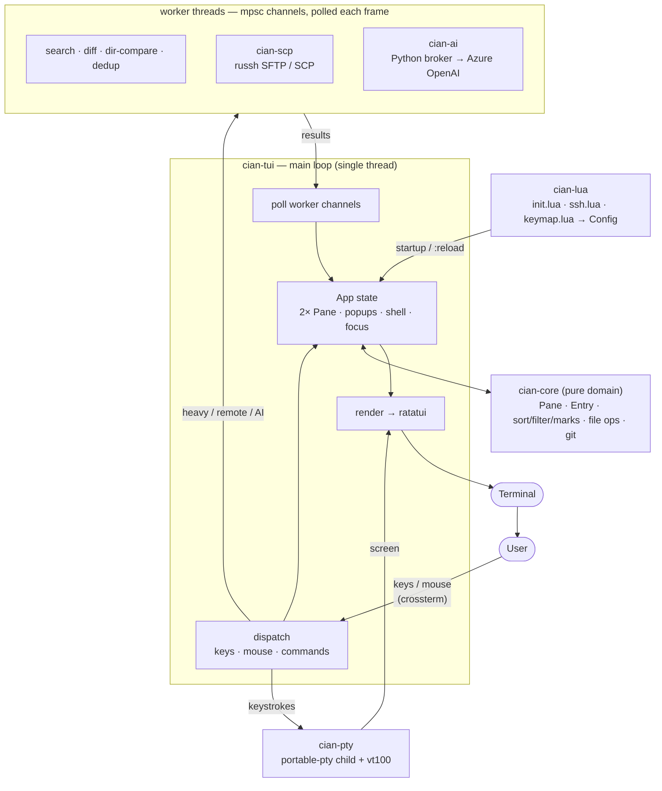

# cian

**English** · [日本語](README.ja.md)

[](https://github.com/taketan9/cian/actions/workflows/ci.yml)
[](https://github.com/taketan9/cian/releases)

**C**omfortable **I**nterface for **A**gile File e**X**plorer **N**avigation — a two-pane terminal file manager with a real shell built in. Inspired by [AFXW (あふｗ)](https://akt.d.dooo.jp/akt_afxw.htm).

One binary. macOS and Windows. No runtime, no DLLs, nothing to install alongside it.

**Contents** — [Download](#download) · [The basics](#the-basics) · [Get around fast](#get-around-fast) · [The text editor panel](#the-text-editor-panel) · [Find things](#find-things) · [Compare and clean up](#compare-and-clean-up) · [Files and version control](#files-and-version-control) · [SSH and remote panes](#ssh-and-remote-panes) · [The shell panel](#the-shell-panel) · [Macros](#macros) · [AI](#ai-optional) · [Japanese input](#japanese-input-ime) · [Configuration](#configuration) · [Build from source](#build-from-source) · [How it fits together](#how-it-fits-together) · [Windows install](#install-on-windows-offline) · [Troubleshooting](#troubleshooting) · [License](#license)

---

## Download

**[→ Releases](https://github.com/taketan9/cian/releases)** — three packages, and a `SHA256SUMS` to check them against.

| Platform | Package | What is in it |
|---|---|---|
| macOS (Intel and Apple silicon) | `cian-macos.zip` | `cian.app` to double-click, and `cian-tui` for the terminal |
| Windows x64 | `cian-windows-x64.zip` | `cian.exe`, `cian-tui.exe` and `install.ps1` — see [offline install](#install-on-windows-offline) |
| Just the engine | `cian-server-win-x64.exe` | about a megabyte — what the Electron front end talks to, for a machine with no Rust |
| Any, to build on | `cian-source-offline.zip` | the source with every dependency already downloaded — see [build from source](#build-from-source) |

Unpack it and run it. There is no installer to answer to, and nothing is written outside the folder you put it in until you save a setting.

**Two builds, one file manager.** `cian` opens a window and needs nothing
installed to run in; `cian-tui` runs inside the terminal you already have,
which is where ssh and tmux need it. Everything below describes `cian-tui`
unless it says otherwise — the window build is the same program with the
terminal taken out from under it.

**If a downloaded `cian.app` "cannot be opened".** macOS quarantines anything a
browser delivered and refuses to run what Apple has not notarised — and since
Sequoia, right-click → Open is no longer a way round it. cian is not signed
with an Apple Developer certificate, so this applies. Any one of these works:

```sh
xattr -dr com.apple.quarantine /path/to/cian.app   # drop the attribute
gh run download <run-id> -n cian-macos             # never gets one: no browser involved
```

System Settings → Privacy & Security, scrolled to the bottom, has **Open
Anyway**. A build you made yourself is never quarantined.

- On Windows use **Windows Terminal** or **WezTerm** with a Nerd Font — that is where the icons and rounded corners look right. Offline install is [further down](#install-on-windows-offline).
- **`?`** shows the full key list, generated from your live keymap, so rebound keys show up too. `cian-tui -man` prints it from a shell; `cian-tui -h` prints the command-line usage.
- The UI is Japanese by default — cian is written in Japanese first. For English: `cian.set_option("lang", "en")`, or the right-click menu.

---

## The basics

Two panes side by side. You copy and move between them — that is the whole idea.

| Key | Does |
|---|---|
| **← / →** | move focus between the panes |
| **Enter** | enter a folder or archive; **read a file right here** — the viewer opens *in that pane*, with everything it can do; `F12` gives it the whole window, `Tab` crosses to the listing beside it, `:q` closes it |
| **Ctrl+Enter** | open the file with its own program (on a folder: open it in the other pane) |
| **Alt+← / Alt+→** | this pane's history, back / forward (or click **◀ ▶** in the title) |
| **Backspace** | up a level (or click the `..` row) |
| **`j` `k`**, arrows | move the cursor |
| **`Space`** | mark the file under the cursor |
| **`Ctrl+A`** | mark everything (`:markall`) |
| **`c` / `m`** | copy / move the marked files to the other pane |
| **`d`** | delete, to the Recycle Bin / Trash |
| **`r`** | rename |
| **`a` / `A`** | new file / new folder |
| **`u`** | undo the last rename, create or move |
| **`F3`** | read the file under the cursor **in the other pane** |

- **Nothing is lost by a slip.** Copy, move and delete always confirm; delete goes to the trash; `u` (`:undo`) walks back the last few renames, creates and moves.
- **Big jobs run in the background** with a progress bar. **Esc** stops one, `b` tucks the popup away and a status chip keeps count (`⏳ copying 45% +2`).
- **Operations queue.** A second copy waits its turn rather than being refused. `:queue` lists the runner and the line; `x` stops or removes one. Failed transfers retry twice; a transfer with no bytes for 30 s is flagged `⚠ stalled`, and a second `x` abandons the dead worker so the rest of the line moves.
- **Long jobs ring the bell** and post a desktop notification when they finish. Off in the toggles (`T`) or `cian.set_option("notify", false)`.

**Mouse.** Click to move the cursor, double-click to open, drag a file onto the other pane to copy it (Shift-drag moves). Dialogs have real buttons, the wheel scrolls any popup, a click off a popup closes it, and dragging a border resizes the split. The right button opens **the system's** context menu in the window build — Explorer's own on Windows (on a file: copy, cut, rename, delete, properties and whatever your programs added; on the empty space between files: the folder's own menu, with **paste** and **new ▸**), an AppKit menu of the system's file actions on macOS (open, open with, show in Finder, Quick Look, copy path, move to trash). cian's own menu is on **Shift+Enter**, on **`M`**, on `:menu`, and on Shift+right-click. In a terminal, where there is no system menu to be had, the right button still opens cian's.

**To and from the desktop.** Files dragged from Finder or Explorer onto the window **move** into the focused pane, after the usual confirm. The other direction cannot be a drag — a terminal program has no window to drag *from* — so **`Shift+P`** puts the selection on the clipboard as real file references, and `Cmd/Ctrl+V` in Finder or Explorer pastes them.

---

## Get around fast

Fuzzy pickers: type a few letters, press Enter.

| Key | Picker |
|---|---|
| **`C`** (`:palette`) | every command |
| **`Z`** (`:jump`) | a recent or bookmarked folder |
| **`:files`** | live file finder over the whole tree |
| **`:recent`** | files opened this session |
| **`T`** (`:toggle`) | live settings — dotfiles, input sync, notifications, verify-transfers, language |
| **`:du`** | disk usage, biggest first; `Enter` drills in |

**`:each <cmd>`** runs a command on every marked file — `:each gzip {}` (`{}` is the path), or `:each md5sum` with the path appended.

---

## The text editor panel

`Enter` and `F3` open the same thing — everything below — in two different places. `Enter` **docks it in the pane** the file was listed in: the other pane stays beside it, the keys are the file's while that pane has focus, and its hints move to the bar along the bottom. `F3` opens it **in the other pane** instead — the listing stays where it is and the file is read beside it, which is what `o` and `Shift+O` already say about a directory. A second `F3` there opens **another tab** rather than replacing what is being read. **F12** makes the panel fill the window and puts it back, which is the same zoom the listings and the shell have. `Tab` crosses between the file and the listing next to it — and between two open files, when both panes hold one — `Shift+Tab` steps this panel's own tabs, `Shift+H` / `Shift+L` / `Shift+J` move the focus to the left pane, the right pane or the shell while you are reading, a click anywhere else moves it there too, and `:q` closes the file.

Docked, the panel keeps its name and its **✕** on its frame and puts everything else along the foot of the window: its keys on the hint bar, its mode (`READ` / `EDIT` / `COMMAND` / `VISUAL`) and the cursor's line and column on the status bar, and the `:` and `/` prompts on cian's own prompt line — the same line the file panes type on.

### What it opens

| Type | Shown as |
|---|---|
| Text | scrollable, with line numbers and syntax highlighting (Rust, Python, JS/TS, Java, HTML, CSS, SQL, shell, Lua, YAML, JSON, …) |
| Markdown | rendered; `:preview` toggles preview ↔ source |
| Images (`.png .jpg .gif .bmp .webp`) | real pixels in the window build and on kitty / iTerm2 / WezTerm / sixel, colour half-blocks anywhere else |
| Office & PDF (`.docx .xlsx .pptx .pdf`, legacy `.doc .xls .ppt`) | their text, no converter needed |
| Archives (`.zip .jar .tar .tar.gz …`) | the member list — `Enter` extracts one, `a` extracts all |
| Anything else | a hex dump |

Shift_JIS is detected and decoded automatically (UTF-16 by BOM); `e` forces an encoding when the guess is wrong.

### Reading

Vim-flavoured: `h j k l`, `w b`, `0 $`, `gg G`, `Ctrl-D/U`, `Ctrl-F/B`, `{` `}`, `%` to the matching bracket. `/` searches and `n`/`N` repeat; `*` and `#` search the word under the cursor. `v` `V` `Ctrl-v` select, `y` copies, `Ctrl+A` selects the whole file. `zz` `zt` `zb` put the cursor's line in the middle, top or bottom of the window.

**Operators take motions.** `d`, `c` and `y` combine with everything above — `dw`, `d$`, `d}`, `d2w`, `dfx`, `c%`, `y}` — and doubled they take the line: `dd`, `cc`, `yy`. **Text objects** are the other half: `diw` / `daw` a word, `ci"` / `da"` a quoted string, `di(` `da(` `di{` `da{` `di[` `di<` a bracketed one, nesting and multi-line included. `f x` jumps to the next `x` and `t x` to just before it (`F` `T` backwards), with `;` and `,` repeating.

**A count goes in front of a motion** and repeats it — `3j`, `5w`, `2}`, `48G` for line 48 — and what you have typed so far shows on the prompt row, so `48G` is not done in the dark. `Esc` abandons it.

| Key | Does |
|---|---|
| `F2` / `Shift+F2` | next / previous open file (mark several, press `F3`, they all open) |
| `Shift+F8` / `Shift+F9` | split left-right / top-bottom; `Shift+F10` closes the split |
| `Shift+H` / `Shift+L` | cross to the other half (or click it) |
| `=` | mark what differs between the two halves — live, while you edit both |
| `]c` / `[c` | step through those differences |
| `]]` / `[[` | next / previous heading or definition |
| `Space` / `za` / `zA` | fold one section / toggle all |
| `:summary` | ask the AI to summarise the file (right-click too). Right-click also has **Review and fix this code** for a selection |
| `?` | the viewer's own key list, grouped by what you are doing |
| **Tab** | cross to the pane beside it and back — a listing or another open file, whichever is there. Never the shell: that is `Shift+J` |
| **Esc ×3** | leave the file the way `:q!` does — one Esc must not close a file with unsaved edits in it, three deliberate presses are not a slip |
| **Shift+Tab** | the next open file **in this panel** (`F2` / `Shift+F2` step either way) |
| `:new` | a blank file to type into, docked in this pane; `:w <name>` saves it and adopts the name |
| `m a` / `' a` | set a mark, jump back to it (`` ` a`` for the column too) |
| `Ctrl+O` / `Ctrl+I` | back and forward through the places you jumped from |
| `.` | do the last change again — including what you typed |
| `]c` / `[c` / `Tab` | next / previous difference, while comparing |
| `:q`  `:q!`  `:wq` | close this file — the last one closes the viewer. **Esc does not close**, and the **✕** in the corner does |

Each open file keeps its own cursor, folds and unsaved edits. Closing a split returns the other file to the tab strip rather than discarding it.

**The outline column** names the headings and definitions of Rust, Python, JavaScript, Java, C, shell, SQL, Lua, Go, Ruby, Markdown, YAML, INI, CSS and Makefiles, with the one the cursor is inside highlighted. It is regular expressions, not a language server: nothing to install, and it works on a stored procedure over SSH. `:outline` puts it away.

**A ruler and a crosshair** sit over the text — every fifth column marked, every tenth numbered, the cursor's column picked out and its line tinted. `:ruler` puts them away.

### Editing

| Key / command | Does |
|---|---|
| `i` `a` `A` `o` `O` `I` | insert — before, after, at the end of the line, on a new one; `Ctrl+S` saves in the file's own encoding, `Esc` leaves, `Shift+Q` discards |
| `s` `S` `C` | substitute a character, a line, the rest of the line |
| `r`*x* / `R` | stamp one character over this one (`3rx` for three); `R` overwrites until `Esc` |

| `x` `dd` `D` `J` | delete and join, vim's small change set; `d` cuts a `v`/`V` selection |
| `p` / `P` | paste after / at the cursor, vi's way |
| `u` / `Ctrl+R` | undo / redo — the last rename, create, move **or step into a folder**, on one stack in the order things happened |
| `gg` / `G` / `5gg` | the top, the bottom, line 5 |
| a line wider than the panel | the view follows the cursor sideways rather than wrapping — a record keeps its shape. Bars on the right and bottom borders say how much is off screen, and appear only when some is |
| `w` `b` `e` / `W` `B` `E` / `ge` | word by word (stopping at punctuation) and WORD by WORD (running to the next space); `ge` is the end of the word behind you |
| `gJ` / `:combine` / `:combine!` / `:combine 3` | join the next line up — without a space, with one, or three lines. (`Shift+J` is the shell.) |
| `Ctrl+R` | redo |
| `Ctrl+S` `Ctrl+C` `Ctrl+X` `Ctrl+V` `Ctrl+Z` `Ctrl+Y` `Ctrl+A` | save, copy, cut, paste, undo, redo, select all — in **all three modes**, reading, editing and over a selection. `Ctrl+C` / `Ctrl+X` take the selection, or the cursor's line when there is none. Each has a command for the terminal that keeps Ctrl: `:w` `:undo` `:redo` |
| `~` | swap the case under the cursor |
| `>>` / `<<` | shift lines by a tab stop (`>` / `<` on a selection) |
| `:edit` | open it in `$VISUAL` / `$EDITOR` — or nvim → vim → vi — and reload on return |
| `Ctrl+Q` / `Alt+v` (`:block`) | rectangular selection — `d` `I` `A` `c`. `$` then `A` appends to the end of every line, however ragged. Terminals differ about which they hand over |
| `V` then `I` / `A` | insert at the start / end of every selected line |
| `:r` after a search | replace, with the pattern already filled in (`r` is vi's replace-a-character) |
| **`Ctrl+H`** (or `:replace`) | **the replace bar** — `find` and `with` on the line along the bottom, the file still in view. `Tab` moves between the fields; `Enter` replaces this one and stops on it, `Shift+Enter` replaces all of them, `Alt+n` steps to the next without replacing. `Alt+r` cycles **as typed → `*` `?` wildcard → regex**, `Alt+c` match case, `Alt+w` whole words. `\n` `\t` `\r` work in either field. In wildcard mode `rep*rt` finds `report`; in regex mode `*` repeats the character before it, so that pattern is `rep.*rt` — and a regex that finds nothing says so |
| `:s/old/new/[gci]` | the same thing said vi's way — `g` every match on a line, `c` confirm each, `i` ignore case |
| `:expand` / `:unexpand` | tabs ↔ spaces |
| `:lf` / `:crlf` | convert the line ending |
| `:nobom` | drop a UTF-8 BOM (from the panes: the marked files) |
| `:g/re/d` | delete every line that matches — `:v/re/d` keeps only those |
| `:sort` `:rsort` `:uniq` | line order and duplicates, over the file or the selection |
| `:han` / `:zen` | width — `:han` normalises full-width ASCII *and* half-width katakana. Like every verb in this table it acts on a `v` / `V` selection when there is one, and on the whole file when there is not |
| `:reindent` | put a document indented by three different hands onto one ladder |

**A save gives the file back.** What is written is the file's own characters — the BOM it arrived with, the line ending it arrived with, its tabs. All three are invisible on screen and all three are real edits, so none happens except on purpose (`:nobom`, `:lf` / `:crlf`, `:expand`). The title shows them: `· UTF-8 BOM`, `· CRLF`.

**The invisible characters** are drawn — tab `→`, trailing space `·`, ideographic space `□`, line feed `↓`, carriage return `↵` — because those are the ones that cause trouble while looking like nothing. `:ws` turns them off. Tab stops are every 4 columns; `cian.set_option("tab_width", 8)` is what makes a tab-separated file line up.

A rectangle is reckoned in **screen columns**, not characters, so a block drawn over Japanese text is the rectangle you drew; short lines are padded for an insert and left alone by a delete. Every one of these is a single undo step.

**Binary files** are edited in hex: `i`, then hex digits overwrite the byte under the cursor. Overwrite only — offsets never shift, the size cannot change — and `Ctrl+S` writes a `.bak` first.

### vim keys, or notepad keys

Everything above is the vi grammar, and it is the default. The same editor
answers to a second one for anyone who does not have vi in their hands:
**`:notepad`**, or `T` from a listing, or **Editor keys** on the panel's own
menu (Shift+Enter). `:editstyle vim` puts it back. It is one editor with two
grammars — the buffer, the undo stack, search, replace and saving are the same
code either way, and the only difference is whether a normal mode exists at
all.

In notepad style the panel is in insert from the moment it opens. Shift with
the arrows selects, Alt+Shift draws a rectangle, Ctrl with the arrows moves by
word, and Ctrl+X / C / V / A / S / Z / Y are what they are everywhere else —
those seven work in vi style too. With no normal mode there is nothing for
`Esc` to return to and no command line to open: **`:` types a colon**, and
`Esc` three times leaves (asking first, if there is anything unsaved).

`cian.set_option("edit_style", "notepad")` makes it the one you start in.

### Around the viewer

- **Cursor-follow preview (on by default).** The shell panel's area previews whatever the cursor is on — code in colour, images, folder and archive listings, Office/PDF text. The shell keeps running underneath; `Shift+J` or a click brings it back. Remote panes deliberately show no preview (it would download every file the cursor touches). Pictures use the terminal's own protocol (kitty / iTerm2 / sixel) when it offers one, and half-blocks otherwise; `:image` switches between them for a terminal that advertises a protocol and then draws nothing, and `:version` says which is in use. `:preview` turns it off, and kinds that would have to be unpacked or scanned to show anything are skipped already — `.vsix`, `.jar`, `.whl`, `.iso`, `.msi`, `.pdf`, `.mdf` and friends — while `.zip` and `.tar` are not, because listing one is the point. `cian.set_option("preview_skip", { "bak" })` adds more. `F3` opens any of them.
- **Walk into archives.** `Enter` on a zip or tarball puts the *pane* inside it, browsing like a folder. Copying out extracts relative to where you stand. For **zip** it works both ways: copy files in, `F2` renames a member, `d` deletes one — rewritten atomically, kept members raw-copied. tar/tar.gz are read-only, and password-protected zips are never modified. `F3` on a member opens the real viewer, and saving puts it back into the zip.
- **Cloud files stay in the cloud.** A synced OneDrive / Teams / iCloud / Google Drive folder lists files that were never downloaded, and reading one pulls it over the network. Panes holding them get a **☁** column, and the sweeps — grep, `:count`, `:hash`, `:duplicate`, `:preview` — skip them and say how many. Deliberate acts (`F3`, a copy, opening a file) still work. `cian.set_option("read_cloud_files", true)` lets the sweeps reach in.
- **Ask about what you are reading.** Right-click (or `Shift+Enter`) for a short menu over the file: improve this writing, explain or write this command, review this code — over the selection, or the whole file. The file steps aside while the answer comes back and returns with it.
- **SharePoint documents.** Tell cian which local folders are synced libraries — `cian.sharepoint{ { local = …, url = … } }` — and `:office` hands the *cloud* copy to Word or Excel, so check-out and co-authoring work. `:officelink` writes a `.url` shortcut to the same address, which is the thing to paste into a mail.
- **Copy and paste without a clipboard.** A yank is kept inside cian as well as on the system clipboard, so copying three lines works on a machine with no clipboard service.

---

## Find things

| Key | Does |
|---|---|
| **`/`** | filter the listing as you type (Enter keeps it, Esc clears) |
| **`f`** | jump between matches in this folder |
| **`Shift+F`** | find by name, anywhere below this folder |
| **`Ctrl+F`** (or `Ctrl+G`, `:grep`) | grep inside files — Enter opens the hit on its line |
| **`b`** | branch view — flatten the whole subtree into one listing |
| **`,`** | sort by name / size / date / extension (`n` `s` `d` `e`) |

Searches run in the background and stream results as they arrive; **Esc** stops one. In a result list, **`p`** panelizes the matches into the pane so you can mark and operate on them.

**`r` on grep results replaces across every file that matched.** It shows every line it would change — file, line, and the result — where `Space` spares a line, `f` spares the rest of that file, `a` flips the lot and `Enter` writes. Nothing reaches disk before `Enter`, and each file is re-read then: any line whose text has moved on since the preview is skipped and counted, because a bulk write against a stale line number is how tools like this eat data.

**Patterns** — the same language everywhere you type a search:

| You type | It means |
|---|---|
| `error` | plain text, case-insensitive |
| `/ORA-\d+/` | a regular expression |
| `/ora-\d+/i` | the same, case-insensitive — `i` is the only flag |
| `/^ERROR/` | lines starting with ERROR (grep) |
| `/\.(log\|trc)$/` | names ending `.log` or `.trc` (find) |

Bare text is literal, with nothing to escape; slashes make it a regex ([Rust `regex`](https://docs.rs/regex) — no backreferences or lookaround). A typo'd regex is rejected with its reason rather than quietly matching something else.

`:hidden` shows or hides dotfiles (shown by default).

**Encodings.** A file that does not decode as UTF-8 is retried as Shift_JIS, so `エラー` finds it in either — which is what the Oracle alert logs and AIX batch output on these machines need.

---

## Compare and clean up

**`=`** (`:diff`) — two files side by side with the differences highlighted (`n`/`N` between them), or two folders compared byte-for-byte. From either:

| Key | Does |
|---|---|
| `>` / `<` | copy the highlighted entry to the other side — a file or a whole subtree |
| `]` / `[` | sync the whole tree one way; never deletes, confirms first |
| `w` | save the comparison as an HTML or Markdown report (the extension picks) |
| `x` | ask the AI what changed |

- **`:duplicate`** finds byte-identical files under this pane and offers them as a checklist; one per group is kept, the rest go through the normal delete confirm.
- **`:renamepattern`** renames the marked files by a template (`report_{n3}.{ext}`) or a substitution (`s/IMG/photo/i`), with an `old → new` review. No AI, no network.
- **`:renamelist`** opens the names in your editor, one per line. Save and quit and each changed line renames its file, swaps included — all-or-nothing, so a duplicate or a lost line cancels the batch rather than half-applying it. `:cq` cancels.

---

## Files and version control

| Command | Does |
|---|---|
| `:attr` | permissions and owner |
| `:chmod 644` | change the mode (Windows: `:readonly`) |
| `:readonly on\|off` | toggle the read-only bit |
| `:hash md5` / `:hash sha256` | checksum the selection |
| `:count` | count files, lines and source steps |
| `:where` | which config files are being read, and from where |

**Bundling.** `:zip` / `:tar` / `:targz` pack the marked files, `:zip -e` makes an encrypted zip, and `:unzip` (right-click **▸ Extract here**) unpacks the file under the cursor into a fresh sub-folder. A locked zip still lists its members on F3, and asks for the password before extracting.

The status line always shows free space on the active pane's drive — amber past 80 % used, red past 95 %.

**git and svn just work.** Each entry gets a badge (`●` staged, `✚` modified, `?` untracked, `‼` conflict), the status line shows the branch (or `svn r123`), and F3 marks changed lines against HEAD. `:stage` `:unstage` `:discard` `:log` `:gitdiff`, and `B` in the viewer for blame — all under right-click **Git ▸** / **SVN ▸**. cian shells out to your own `git` / `svn`.

---

## SSH and remote panes

**`:remote`** (`:sftp`) turns one pane into the server, framed in **carmine** so it is never mistaken for local. It moves like any pane, and:

| Key | Does |
|---|---|
| `c` / `m` | copy / move across the boundary — local↔server, or server↔server relayed through this machine |
| `A` `a` `r` `d` | new folder, new file, rename, delete on the server (delete is recursive, and always confirms) |
| `F3` | open a remote file; saving uploads it straight back |
| `Esc` | leave, and the pane returns to local disk |

Right-click **Transfer ▸** does the same as a one-shot: **Upload → server** (pick host, user, remote folder, optional mode) or **Download ← server** (browse, mark, choose where they land).

It is pure Rust — no external `scp`. SFTP, falling back to classic SCP where there is no SFTP subsystem; the status line says which. `cian.set_option("verify_transfers", true)` re-reads each file and checksums both ends.

**`Shift+S`** (`:ssh`) opens a host-then-user picker and types the command into the shell, so your own ssh config and agent apply. Hosts live in `init.lua`:

```lua
cian.ssh({
  users = { "root", "deploy", "app" },          -- offered for every host
  hosts = {
    { name = "web1", host = "10.0.1.11" },
    { name = "db1",  host = "10.0.2.31", users = { "postgres", "root" } },
    { name = "bast", host = "203.0.113.9", port = 2222 },
  },
})
```

Passwords are optional — cian types one when ssh asks, and reuses it for SFTP/SCP:

```lua
users = {
  { name = "postgres", password = "..." },                 -- in this file
  { name = "deploy",   password_cmd = "pass srv/deploy" },  -- from a credential store
  "root",                                                   -- key auth; nothing stored
}
```

A plaintext password is a secret in a file, and cian warns on Unix if that file is world-readable. It is never logged, never shown, and never answered to a host-key prompt.

**Bandwidth.** A copy to a server is a copy over somebody else's network. `:limit 2M` holds transfers to two megabytes a second (`500k`, `1.5MB/s`, `off`), `cian.set_option("transfer_limit", "2M")` sets it every launch, and the progress bar says `≤2.0M/s` while it applies so a deliberate crawl never looks like a broken one.


---

## The shell panel

The bottom panel is a real shell (your `$SHELL`). **`Shift+J`**, a click or `:shell` focuses it; **Esc** returns to the files. **Output that has scrolled past is kept** — 10,000 lines of it, with its colours: the wheel over the panel scrolls back through it, `Shift+PageUp` / `Shift+PageDown` a page at a time, `Shift+↑` / `Shift+↓` a line, `Shift+Home` / `Shift+End` the two ends. A badge and a bar say how far back you are, and typing anything returns to live output. Each half of a split scrolls on its own. Full-screen programs (vim, less, htop) keep Esc and the function keys for themselves. Drag to select — it copies on release. Right-click for its own menu: SSH connect, paste, session log, SFTP/SCP, text encoding.

| Key | Does |
|---|---|
| `F1`–`F8` | switch to shell tab 1–8 |
| `F9` / `F10` | new tab / close tab |
| `Shift+F1` / `Shift+F2` | focus next / previous split pane |
| `Shift+F8` / `Shift+F9` | split side by side / stacked |
| `Shift+F10` | close the split (asks first) |
| `F12` / `Shift+F12` | zoom the whole surface / just the split |

**Synchronize input** across a tab's panes with `:sync` or right-click — type once, it reaches every pane, and they wear a bright **⇄ SYNC** border while it is on.

**Snippets** are the lines you type over and over:

```lua
cian.snippets{
  { name = "sqlplus dev", cmd = "sqlplus user@DEVDB", enter = false },
  { name = "tail app log", cmd = "tail -f /var/log/app/app.log" },
  { name = "hulft send",  cmd = "utlsend -f SENDID -sync", confirm = true },
}
```

**Ctrl+Shift+Enter** (`:snip`) opens the picker; type to filter, Enter sends the line. `enter = false` types it for review, `confirm = true` asks first.

---

## Macros

**`@`** (`:macro`) picks one. Two kinds.

**Layout macros** build the screen — split the panel, SSH each pane somewhere, tint them apart, start logging:

```lua
return {
  { name = "Prod: db + app + logs", panes = {
    { cmd = "ssh admin@db",  bg = "40,24,24", log = "~/cian-logs" },
    { dir = "right", cmd = "ssh admin@app", bg = "24,40,24" },
    { dir = "down",  cmd = "ssh admin@app", steps = { "tail -f /var/log/app.log" } },
  }},
}
```

Per pane: `dir` (`right`/`down`), `cmd`, `steps` (a scripted login that can `{ wait = 2 }` and `{ expect = "SQL>" }`), `bg`, `log`. Add `from = N` for a grid, `zoom = true`, `sync = true`. Examples: [`examples/macro.en.lua`](examples/macro.en.lua), [`examples/macro/`](examples/macro/).

**Script macros** automate file operations — give the macro a `run` function and use Lua's own `for` and `if`:

```lua
return {
  name = "Archive *.log, then bin them",
  run = function(cx)
    local logs = cx.glob("*.log")
    if #logs == 0 then cx.message("no logs here") return end
    cx.zip(logs, "logs.zip")
    cx.delete(logs)                     -- to the trash
    cx.message("archived " .. #logs .. " logs")
  end,
}
```

`cx` has **query** (`dir`, `other`, `marked`, `cursor`, `list`, `glob`), **operations** (`copy`, `move`, `delete`, `rename`, `mkdir`, `zip`, `read`, `write`), **subprocess** (`sh("cmd")` → `{ code, out, err }`), **paths** (`basename`, `stem`, `ext`, `join`, `exists`, `isdir`, `size`) and `message`. A dozen worked samples are in [`examples/macro/Escript.en.lua`](examples/macro/Escript.en.lua).

`cian-tui --macro thing.lua` runs one at startup (so a `.lua` associated with `cian-tui.exe` runs on double-click); `--macro-name "…"` runs one from your config.

**Snippet or macro?** One shell and a command or two → snippet. Several panes wired up, or a file-op job → macro.

---

## AI (optional)

Off unless `cian.ai{…}` is set, and always in the loop — nothing runs or deletes without your say-so.

| Command | You get |
|---|---|
| `:ai` | a chat |
| `:aicmd <what you want>` | a shell command for the shell you are in, local or the server you are SSH'd into — drafted for review, never run for you |
| `:aicommit` | a commit message from the staged diff |
| `:aijunk` | a checklist of likely-disposable files → the normal delete confirm |
| `:aiorganize` | a proposed folder layout → you approve the moves |
| `:airename` | suggested names → you review `old → new` |
| `:aisearch <…>` | files most relevant to a description |
| `:aierror` | explain the last shell error |
| `:aidiff` | explain the diff on screen (also `x` in the diff view) |
| `:ailog` | triage the selected log — errors, timeline, likely cause |
| `S` in F3 | summarise the file being read |

**The conversation carries, in both builds** — the window has a chat now, and
all six doors (`:ai`, summarise, explain the error, explain the diff, triage
the log, the three over a selection) land in it. It sends what has been said so far, so "the one you just mentioned" means something. When it grows long the oldest turns are dropped **whole** — half a turn is a sentence with no speaker — and the newest one is always sent however heavy it is, because it is what the next question is about. The structured requests (`:airename` and friends) stay one-shot: a machine reads those answers, and an earlier turn in the request is an earlier turn's format in the reply.

**Give it context.** `cian.ai_context("…")` records facts about your setup — the OS, the deployment target, house rules — and cian prepends them to every prompt. Per-server facts go on the host (`notes = "RHEL 8; Oracle 19c; …"`) and are handed over when the shell is logged into it.

cian reaches the model through a small bundled Python helper (Windows broker sign-in). `auth_mode = "mock"` is an offline echo for wiring it up; `api_base_url` points at a local server (Ollama, LM Studio). This is the one place cian is not fully self-contained, which is why it is opt-in. See [`examples/init.en.lua`](examples/init.en.lua).

---

## Japanese input (IME)

While an IME is composing, a letter never reaches cian at all — the terminal holds it until it is committed — so single-key commands do nothing until the IME is off. cian cannot see a key it is not sent.

**Punctuation it can see.** `：` `／` `？`, and the kana layout's `・`, are read as the colon / slash / question keys, so they open what those keys open. A `:` verb typed full-width (`ｍａｎ`) runs too. Text is never folded: a name may hold a full-width colon on purpose, and on Windows it must.

**For the letters, cian switches the input method with its own mode.** Commands are always the off source; when you start typing it puts back *whatever you were last typing with*, learnt by reading the input source each time it takes the keyboard back. Turn the IME off mid-rename and the next prompt opens off. Until it has learnt anything — or if the helper cannot be read — text opens with the IME off and you turn it on yourself, which is then what it remembers.

It needs a helper that prints the current input source and switches to the one it is given. On macOS one ships with cian — thirty lines around the system's own API, nothing third-party:

```sh
swiftc -O -o ~/.local/bin/cian-ime examples/cian-ime.swift
cian-ime                                     # prints the current input source id
```

```lua
cian.ime{
  helper = "$HOME/.local/bin/cian-ime",
  off    = "com.apple.keylayout.ABC",
}
```

`macism` and `im-select` have the same shape (`helper = "macism"`), on Windows too; an odd helper can spell out `query` and `set` (`set = "switch --to {}"`). **`:ime`** shows the configuration, what cian remembers and what the last switch did — the first thing to look at if nothing happens. `:ime on` / `:ime off` switch there and then.

---

## Configuration

cian reads `~/.config/cian/init.lua` (override with `$CIAN_CONFIG_DIR`). It is Lua, on a small `cian` table, and no init.lua is needed to start:

```lua
cian.set_theme({ accent = "#00d7d7", mark_fg = "yellow" })
cian.set_option("verify_transfers", true)
cian.set_keymap("x", "delete")           -- binding a key replaces its default; "none" disables it
cian.on_open("md", function(path)        -- open .md files your way
  cian.spawn({ "open", "-a", "Typora", path })
end)
```

- **A broken config never blocks startup** — cian reports the error and falls back to defaults for whatever did not apply. `:reload` re-reads it live (keymaps, options, SSH hosts, open handlers; theme and borders need a restart).
**Font size — `Ctrl+-` / `Ctrl++`.** A program inside a terminal cannot resize that terminal's font: the font belongs to the emulator and there is no portable escape sequence for it. What cian does is own the keys, remember the level between sessions, and run the command your terminal understands:

```lua
cian.font{ set = "kitten @ set-font-size {}", start = 13, min = 8, max = 28 }   -- kitty
cian.font{                                                                     -- macOS, any terminal
  bigger  = [[osascript -e 'tell application "System Events" to keystroke "+" using command down']],
  smaller = [[osascript -e 'tell application "System Events" to keystroke "-" using command down']],
}
```

**The typeface — `face`. The window build only.** A terminal's face is the
emulator's, for the same reason its size is. The window draws through Chromium
and can be told:

```lua
cian.font{ face = "JetBrainsMono Nerd Font" }
```

**The bundled face stays.** A name here only moves to the front of the queue;
every fallback behind it is still there, so a character the chosen face has no
glyph for — Japanese in a Latin-only Nerd Font, say — does not fall through to
whatever the machine calls its default, which on Japanese Windows is 明朝.
This is a program that draws in columns, and a proportional face has none.

**A face that is not installed is walked past in silence** — indistinguishable
from one that is. So cian says so once when it cannot find the name, and
`:version` reports the face that was actually used.

`set` (with `{}` for the size) is the one worth having: it is the only form cian can put *back* at startup. A `bigger`/`smaller` pair only knows how to step, so the size lasts as long as the window does. With nothing configured the keys say so rather than doing nothing.

- **Themes.** 18 presets, live-previewed: `:theme` opens the gallery, `:theme <name>` sets one, and panes can be themed separately. The choice survives a restart.
- **Portable.** Put `init.lua` (and `shortcuts.lua` / `macro.lua`) next to the executable and that folder wins over `~/.config/cian` for reading *and* writing — binary and config travel together on a USB stick, leaving nothing on the host. `:where` says which files are in use.
- **Session.** With no path on the command line, cian reopens the two folders you had last time.
- **Every file-pane action has a name you can bind** — [`examples/init.en.lua`](examples/init.en.lua) is a fully-commented template with every default binding and the complete action list.
- **Windows paths need long brackets**, since a backslash is an escape in Lua: `cian.set_option("shell", [[C:\Windows\System32\WindowsPowerShell\v1.0\powershell.exe]])` — or just a bare name looked up on PATH.

---

## Build from source

```sh
cargo build --release
./target/release/cian-tui   # in your terminal
```

Stable Rust and nothing else — cargo fetches the rest. The window is Electron
and is not built by cargo: `gui/run.sh` (macOS / Linux) or `gui/run.bat`
(Windows). The bundled Japanese Nerd Font is picked up by `node gui/vendor.js`
from `vendor-font/cian.ttf`.

**Building where there is no network.** `cian-source-offline.zip` on the
releases page is the same source with every crate it depends on already
downloaded into `vendor/`, so `cargo build --release --offline` works on a
machine that has never reached crates.io. Three of the dependencies compile C
of their own, so that machine also needs a C toolchain — on Windows, Visual
Studio Build Tools, CMake and NASM. The zip carries the instructions for
installing those offline as well. Each release is checked by building the
bundle on a Windows runner with cargo cut off from the network, so the claim
is tested rather than asserted.

---

## How it fits together

A cargo workspace of seven crates. One main loop owns all UI and drawing; anything that could block — search, diff, transfer, AI — runs on a worker thread whose result is polled back each frame, so the UI never freezes.

| Crate | Role |
|---|---|
| `cian-core` | Pure logic: file ops, marks, sorting, search, diff, dedup, git |
| `cian-tui` | Rendering and input (ratatui + crossterm), layout, popups, mouse |
| `cian-pty` | The embedded shell (portable-pty + vt100) |
| `cian-scp` | Built-in SFTP/SCP transfer (pure-Rust russh) |
| `cian-ai` | Optional AI helper (Azure OpenAI via a bundled Python script) |
| `cian-lua` | Lua config host (mlua): keymaps, themes, macros |
| `cian-bin` | The terminal entry point — produces the `cian-tui` binary |



---

## Install on Windows (offline)

Self-contained executables — no runtime, no DLLs, no network. Take `cian-windows-x64.zip` from the [releases](https://github.com/taketan9/cian/releases) on a machine that has one, check it against `SHA256SUMS`, and carry it across:

```powershell
Get-FileHash cian-windows-x64.zip -Algorithm SHA256
```

To build the zip yourself instead — from a Mac, with no Windows dev machine — the bundled workflow does it on a real Windows runner: push a tag (`git tag v1.1.0 && git push --tags`), or **Actions → release → Run workflow**, and take the artifact from that run.

On the offline machine, unzip and either run `cian-tui.exe` where it sits, or put it on PATH:

```powershell
powershell -ExecutionPolicy Bypass -File .\install.ps1
```

That installs for the current user under `%LOCALAPPDATA%\Programs\cian`, no admin needed. For all users, from an elevated PowerShell:

```powershell
powershell -ExecutionPolicy Bypass -File .\install.ps1 -Dest "C:\Program Files\cian" -AllUsers
```

Open a new terminal and type `cian-tui`. Use a Nerd Font terminal for the file-type icons.

---

## Troubleshooting

- **Which build?** `cian-tui --version` prints the commit baked in at build time. An old `cian-tui.exe` on PATH looks exactly like a missing feature.
- **Border corners** default to square in the legacy Windows console and rounded elsewhere. Force it with `cian.set_option("borders", "rounded")` (or `"plain"`).
- **A key that does nothing?** The terminal may be keeping it — a Mac terminal takes Ctrl+F for its find bar, Ctrl+Q for the system zoom — and a key that never arrives cannot be handled. **`:key`** reports each keystroke as cian received it and names the keyboard mode in effect; `CIAN_LEGACY_KEYS=1` starts without the enhanced-keyboard request. Move the binding somewhere your machine will deliver (`cian.set_keymap("alt+g", "grep_recursive")`), or use the command: the Ctrl-only shortcuts all answer to `:w`, `:q`, `:grep`, `:block`.
- **Screen scrambled?** `:redraw` repaints from nothing, for when a stray control character leaves text cian never drew.
- **Trouble?** `CIAN_LOG=/tmp/cian.log` captures diagnostics. A panic restores the terminal on the way out, so you are never left needing `reset`.

---

## License

MIT — see [LICENSE](LICENSE).
